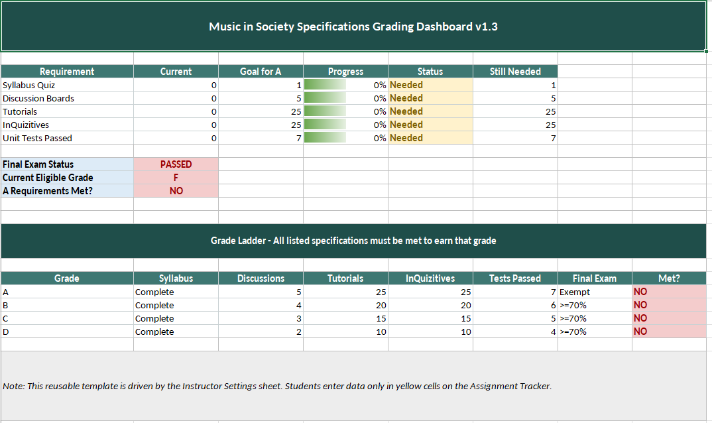
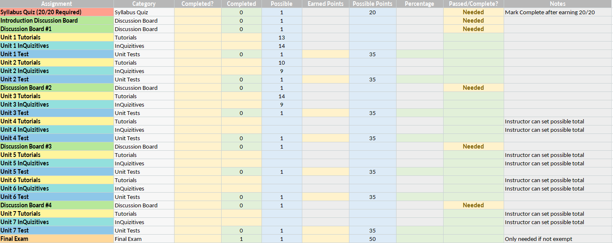
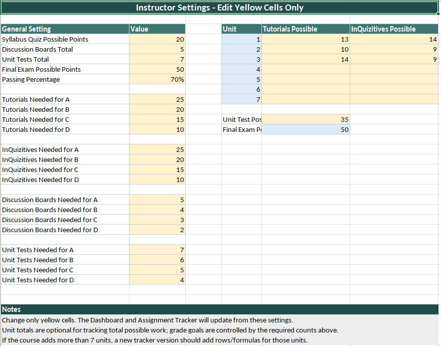

# Music Course Specifications Grading Dashboard

An Excel-based dashboard designed to simplify **specifications grading** for both students and instructors. The workbook automatically tracks student progress, calculates letter grade eligibility, monitors final exam exemption status, and allows instructors to customize grading requirements through a centralized settings page.

---

## Features

- 📊 Interactive Dashboard
  - Current letter grade
  - Grade ladder (A/B/C/D/F)
  - Progress toward requirements
  - Final exam exemption status

- 📝 Assignment Tracker
  - Unit-by-unit tutorial tracking
  - InQuizitive tracking
  - Discussion board completion
  - Test score entry
  - Automatic pass/fail detection

- ⚙️ Instructor Settings
  - Customize grading thresholds
  - Adjust tutorial requirements
  - Adjust InQuizitive requirements
  - Change discussion requirements
  - Modify passing percentage
  - Reuse the workbook for future semesters

- 🎨 Color-Coded Design
  - 🟨 Yellow = Student input
  - 🟦 Blue = Reference values
  - 🟩 Green = Automatically calculated
  - 🔴 Red = Requirements not met

---

## Why This Project?

Many Learning Management Systems (LMS), such as Canvas, do not natively support specifications grading very well. Students are often forced to manually track completed work and determine their own letter grade.

This dashboard was created to automate that process by providing a clear, visual interface that updates automatically as assignments are completed.

---

## Skills Demonstrated

- Microsoft Excel
- Formula Design
- IF Statements
- AND / OR Logic
- SUMIF
- COUNTIF / COUNTIFS
- Conditional Formatting
- Data Validation
- Dashboard Design
- User Experience (UX)
- Requirements Analysis
- Debugging and Testing

---

## Screenshots

### Dashboard

### Assignment Tracker

### Instructor Settings

---

## Future Improvements

- Protect formula cells while leaving input cells editable.
- Add printable report layout.
- Improve dashboard visualizations.
- Expand support for additional grading models.
- Continue refining usability based on instructor and student feedback.

---

## License

MIT License

---

## Author

Jim Crawford

GitHub: https://github.com/JCrawford75
Portfolio: https://jimc-portfolio.duckdns.org
